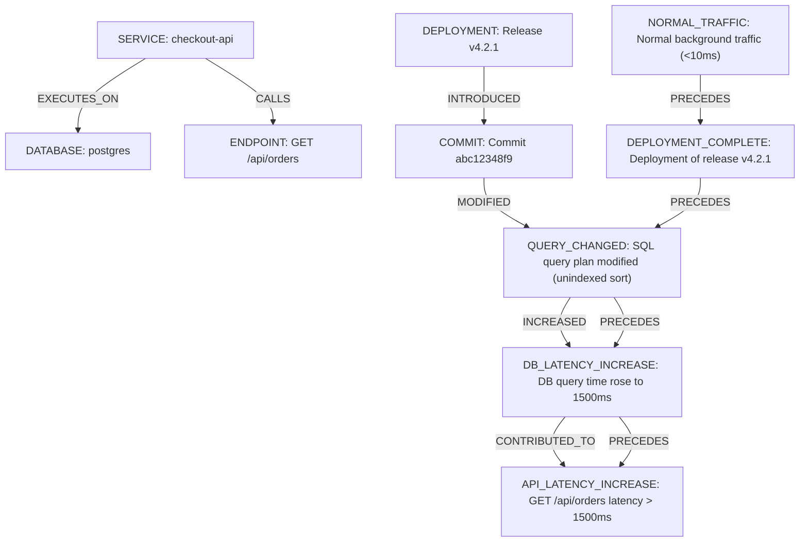

# Aletheia Architecture: Phase 4 Evidence Model & Graph

## Overview

Phase 4 establishes the central technical contribution of Aletheia: the **deterministic, time-aware Evidence Graph**.

In alignment with the core project principle:
> *"The goal isn't to build an AI that guesses what went wrong. It's to build an investigation system that gathers evidence, constructs explanations, challenges them, and can be measured when it gets the diagnosis wrong."*

The LLM is **not** the core of Aletheia. The LLM does not invent evidence, does not serve as the database, and does not replace telemetry. Instead, the system deterministically constructs an evidence graph directly from observable system artifacts (logs, metrics, traces, deployment events, and Git commits). The diagnostic AI agents introduced in later phases will reason strictly over this structured graph.

---

## 1. Evidence Schema & Provenance

Every collected evidence item adheres to the [EvidenceItem](file:///c:/Users/Raaid/Downloads/aletheia/src/aletheia/evidence/schema.py) model:

- `evidence_id`: Globally unique identifier (e.g. `EV-LOG-0001`, `EV-SPAN-0001`, `EV-DEP-0001`).
- `timestamp`: UTC datetime of the event or measurement.
- `source`: Source system (`APPLICATION_LOG`, `PROMETHEUS`, `OPENTELEMETRY`, `GITHUB`, `POSTGRESQL`).
- `type`: Evidence category (`LOG`, `METRIC`, `TRACE`, `SPAN`, `DEPLOYMENT`, `COMMIT`, `CONFIGURATION`).
- `service`: Primary originating service.
- `entity_ids`: References to associated system entities.
- `content`: Human- and agent-readable factual summary.
- `data`: Raw structured attributes and telemetry payloads.
- `provenance`: Detailed audit trail:
  - `source_type`: Originating technology.
  - `source_uri`: Exact location (file path, endpoint URL, stream).
  - `extracted_at`: UTC timestamp of collection.
  - `extraction_method`: Adapter method used.
  - `raw_reference`: Span ID, log pointer, commit hash, or metric selector.

---

## 2. Entity Representation

System entities are normalized into the [Entity](file:///c:/Users/Raaid/Downloads/aletheia/src/aletheia/evidence/entities.py) schema:

| Entity Type | ID Format | Example | Key Properties |
|---|---|---|---|
| `SERVICE` | `svc:{name}` | `svc:checkout-api` | version, environment |
| `DEPLOYMENT` | `deploy:{service}:{version}` | `deploy:checkout-api:v4.2.1` | version, commit_sha, timestamp |
| `COMMIT` | `commit:{sha}` | `commit:abc12348f9` | author, message, changed_files |
| `DATABASE` | `db:{name}` | `db:postgres` | system, database_name, host |
| `ENDPOINT` | `ep:{service}:{method}:{path}` | `ep:checkout-api:GET:/api/orders` | method, path |
| `METRIC` | `metric:{service}:{name}` | `metric:checkout-api:http_request_duration_seconds` | metric_name, unit |
| `ERROR` | `err:{service}:{type}` | `err:checkout-api:HTTP_500` | error_type, message |
| `TRACE` | `trace:{trace_id}` | `trace:fcb3dec3df421e4625f8490da2896e9d` | trace_id, duration_ms |

---

## 3. Explicit Typed Relationships

Relationships between graph nodes are strictly typed:

- **Causal & Influence**:
  - `INTRODUCED`: Release/deployment introduced a commit or configuration change.
  - `MODIFIED`: Commit or operation modified a code path, query, or configuration.
  - `EXECUTES_ON`: Service or operation executes against a database or resource.
  - `CALLS`: Service or client calls an endpoint or dependency.
  - `INCREASED`: Change increased a metric or execution duration.
  - `CONTRIBUTED_TO`: Resource latency or slowdown contributed to upstream API latency.
  - `CAUSED`: Slowdown or degradation directly caused errors or SLA violations.
- **Temporal Sequence**:
  - `PRECEDES`: Event $A$ occurred strictly before Event $B$.
  - `COINCIDES_WITH`: Events occurred within the same operational time window.
- **Adversarial & Associative**:
  - `CORRELATES_WITH`: Metric or log anomaly correlates in time.
  - `CONTRADICTS`: Evidence contradicts a claimed causal link or hypothesis.

Every edge explicitly tracks `evidence_ids` linking directly back to the backing evidence items.

---

## 4. Deterministic Timeline

The [Timeline](file:///c:/Users/Raaid/Downloads/aletheia/src/aletheia/evidence/events.py) builder strictly orders events chronologically:

```
=== INCIDENT TIMELINE ===
[2026-09-25 02:00:00 UTC] [checkout-api] [NORMAL_TRAFFIC] Normal background traffic across checkout endpoints (<10ms latency) (evidence: EV-METRIC-0001)
[2026-09-25 02:02:00 UTC] [checkout-api] [DEPLOYMENT_COMPLETE] Deployment of release v4.2.1 completed on checkout-api (evidence: EV-DEP-0001)
[2026-09-25 02:03:00 UTC] [checkout-api] [QUERY_CHANGED] Order history SQL query execution plan modified (unindexed sort) (evidence: EV-GIT-0001)
[2026-09-25 02:04:00 UTC] [checkout-api] [DB_LATENCY_INCREASE] Database query execution time rose from 3ms to 1500ms on orders query (evidence: EV-SPAN-0001)
[2026-09-25 02:05:00 UTC] [checkout-api] [API_LATENCY_INCREASE] GET /api/orders average and P99 latency exceeded 1500ms SLA (evidence: EV-METRIC-0001, EV-METRIC-0002, EV-LOG-0001)
=========================
```

---

## 5. INC-001 Reconstructed Evidence Graph

For `INC-001` (Database Query Regression), the system deterministically builds the following causal structure:



---

## 6. Inspection Interfaces

### CLI Inspection:
```bash
# Print ASCII timeline
python -m aletheia.graph.cli --inspect-inc001 --timeline

# Find causal paths
python -m aletheia.graph.cli --inspect-inc001 --paths

# Generate Mermaid diagram
python -m aletheia.graph.cli --inspect-inc001 --mermaid
```

### REST API:
- `GET /api/v1/investigation/timeline`: Reconstructed timeline with ASCII rendering and event details.
- `GET /api/v1/investigation/graph`: Full evidence graph with nodes, edges, summary, and Mermaid diagram.
- `GET /api/v1/investigation/paths?source=deploy:checkout-api:v4.2.1&target=evt:EVT-005`: Discovered directed causal paths.
